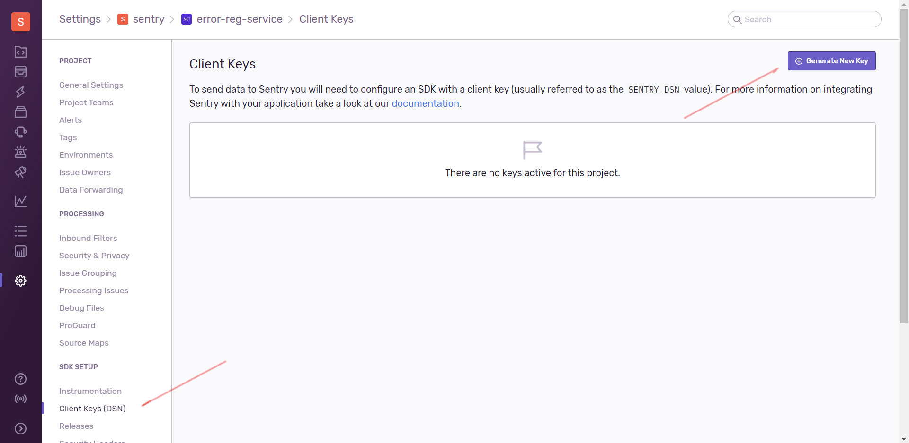
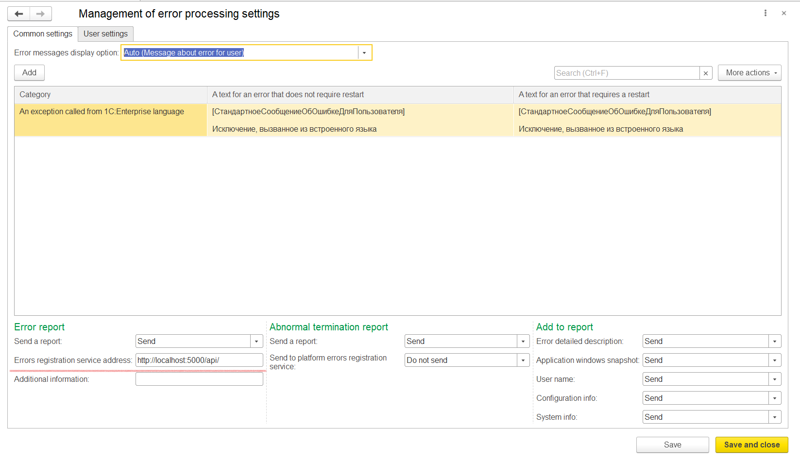
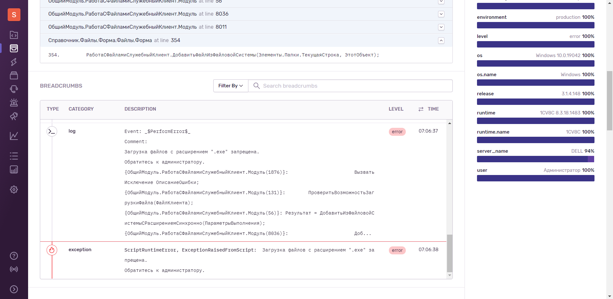

# Sentry Reg Service

Сервис служит прокси между [Cервисом регистрации ошибок](https://its.1c.ru/db/v8318doc#bookmark:dev:TI000002264) платформы и системой сбора ошибок [Sentry](https://sentry.io/).

Как развернуть [Sentry onpremise](https://github.com/getsentry/onpremise).

Создать в корне проекта файл `.env` с содержанием:

```ini
SENTRY_DSN=https://{PUBLIC_KEY}@{HOST}{PATH}/{PROJECT_ID}
```

Например:

```ini
SENTRY_DSN=https://234234234234234@server.ingest.sentry.io/2342324
```

Для создания `DSN PUBLIC KEY` надо в Sentry открыть
`Settings` → `Projects` → имя проекта → `Client keys (DSN)` → `Generate New Key`



Запустить сборку сервиса регистрации

```bash
docker compose build
docker compose up
```
Проверить в баузере `http://localhost:5000`, должно появиться `alive`.

Указать в информационной базе адрес сервиса регистрации `http://localhost:5000/api` и отметить все поля как отправляемые автоматически.



Для того, чтобы отправлять сообщения автоматически после их появления, а так же для того, чтобы последние 15 сообщений журнала регистрации попадали в `BREADCRUMBS`, надо установить расширение `infobase_extension/SentryPushReports.cfe`.


